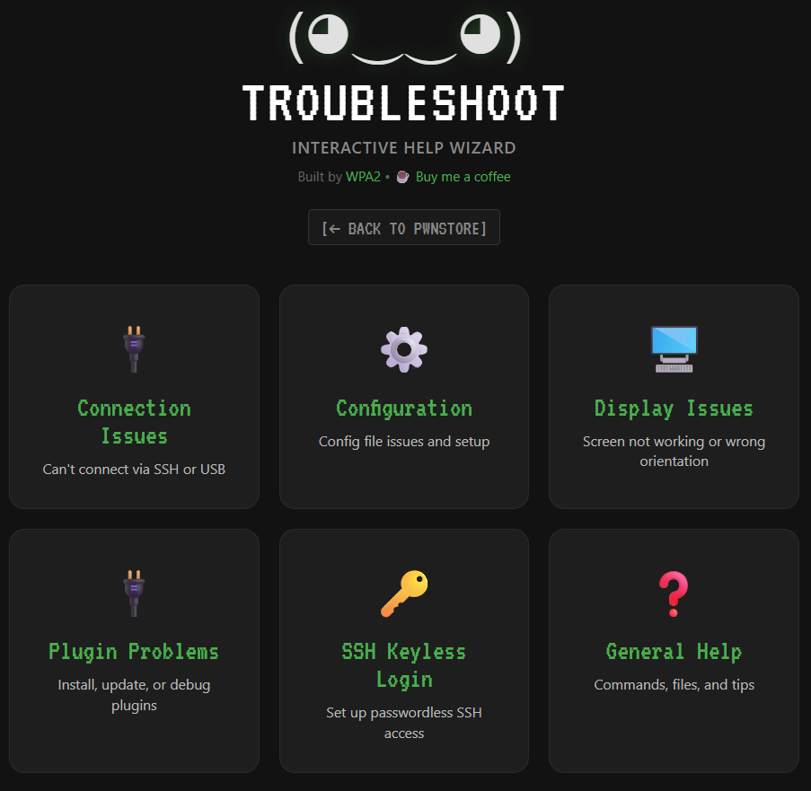

# 🛠️ Troubleshooting Guide

Having issues? We've got you covered!

---

## 🎯 Interactive Troubleshooter (Recommended!)

**Can't connect? Display not working? Plugin won't install?**

👉 **[https://pwnstore.org/troubleshoot.html](https://pwnstore.org/troubleshoot.html)**

Our interactive wizard guides you through fixing:
- 🔌 **Connection Problems** - USB, Ethernet, SSH (Windows/Mac/Linux)
- ⚙️ **Configuration Issues** - config.toml editing, plugin setup
- 🖥️ **Display Problems** - 80+ display types, rotation, hardware
- 🔌 **Plugin Issues** - Installation, debugging, dependencies
- 🔑 **SSH Keyless Setup** - Passwordless access
- ❓ **General Help** - Commands, file locations, tips

**How it works:**
1. Click the category matching your problem
2. Answer a few simple questions
3. Get step-by-step instructions
4. Copy commands with one click
5. Fix your issue! 🎉

**Works on any device** - no Pwnagotchi connection needed!



---

## 🔧 Common PwnStore Issues

### CLI Tool Issues

#### "pwnstore: command not found"

**Solution:**
```bash
# Reinstall PwnStore
sudo wget -O /usr/local/bin/pwnstore https://raw.githubusercontent.com/wpa-2/pwnagotchi-store/main/pwnstore.py && sudo chmod +x /usr/local/bin/pwnstore

# Verify
which pwnstore
```

#### Plugin Install Fails

**Check network connectivity:**
```bash
ping -c 3 github.com
```

**Common causes:**
- Network connection issues
- GitHub is down
- Plugin URL changed
- Permissions problem

**Try manual install** (check your `custom_plugins` path in `/etc/pwnagotchi/config.toml` first):
```bash
cd <your_custom_plugins_directory>
sudo wget <plugin_raw_url>
```

#### Plugin Won't Load After Install

**Check it's in config:**
```bash
grep <plugin_name> /etc/pwnagotchi/config.toml
```

**Check logs:**
```bash
pwnlog | grep <plugin_name>
```

**Run debug mode:**
```bash
sudo systemctl stop pwnagotchi
sudo pwnagotchi --debug
```

---

### Web UI Issues

#### Page Won't Load

**1. Check plugin is enabled:**
```bash
grep pwnstore_ui /etc/pwnagotchi/config.toml
```

Should show:
```toml
[main.plugins.pwnstore_ui]
enabled = true
```

**2. Check Pwnagotchi is running:**
```bash
sudo systemctl status pwnagotchi
```

**3. Check logs:**
```bash
sudo journalctl -u pwnagotchi | grep pwnstore_ui
```

**4. Try accessing directly:**
```bash
curl http://10.0.0.2/plugins/pwnstore_ui/
```

#### Install Button Doesn't Work

**1. Verify CLI tool exists:**
```bash
which pwnstore
# Should show: /usr/local/bin/pwnstore
```

**2. Check browser console (F12):**
Look for JavaScript errors

**3. Clear browser cache:**
- Desktop: Ctrl + Shift + R
- Mobile: Settings → Clear cache

#### CSRF Token Errors

Update to latest version:
```bash
sudo pwnstore install pwnstore_ui
sudo systemctl restart pwnagotchi
```

---

## 🐛 General Pwnagotchi Issues

### Can't Connect to Pwnagotchi

**Use the interactive troubleshooter!**  
👉 [pwnstore.org/troubleshoot.html](https://pwnstore.org/troubleshoot.html)

It covers:
- Windows USB setup (v2.9.5.4+ and older)
- Mac USB setup
- Linux USB setup
- Ethernet connections
- SSH issues

### Display Not Working

**Use the display troubleshooter!**  
👉 [pwnstore.org/troubleshoot.html](https://pwnstore.org/troubleshoot.html) → Display Issues

Covers:
- 80+ display types
- Rotation problems
- Hardware issues
- Config verification

### Plugin Won't Enable

**Check config syntax:**
```bash
sudo pwnagotchi --debug
```

**Common mistakes:**
- Capital letters in booleans (use lowercase `true` not `True`)
- Missing quotes around strings
- Wrong section headers

**Example correct config:**
```toml
[main.plugins.discord]
enabled = true
api_key = "your_key_here"
```

---

## ⚠️ Critical Warnings

### 🚨 NEVER run this command:
```bash
sudo apt-get upgrade    # ← WILL BREAK PWNAGOTCHI!
```

### ✅ This is OK:
```bash
sudo apt-get update     # ← Safe, updates package list
```

### Manual Plugin Install
- ✅ **Use RAW file URLs** from GitHub (click "Raw" button)
- ❌ **Don't use root + Filezilla** - use wget method instead

---

## 📝 Debugging Checklist

When something goes wrong, check these in order:

1. **Is Pwnagotchi running?**
   ```bash
   sudo systemctl status pwnagotchi
   ```

2. **Check the logs:**
   ```bash
   pwnlog
   # or
   sudo journalctl -u pwnagotchi -f
   ```

3. **Run in debug mode:**
   ```bash
   sudo systemctl stop pwnagotchi
   sudo pwnagotchi --debug
   ```

4. **Verify config syntax:**
   ```bash
   cat /etc/pwnagotchi/config.toml
   ```

5. **Check plugin files exist:**
   ```bash
   ls -la $(grep custom_plugins /etc/pwnagotchi/config.toml | cut -d'"' -f2)
   ```

6. **Restart everything:**
   ```bash
   sudo systemctl restart pwnagotchi
   ```

---

## 💬 Get Help

### Interactive Wizard
🛠️ [pwnstore.org/troubleshoot.html](https://pwnstore.org/troubleshoot.html)

### Community Support
- 💬 **Discord:** [discord.gg/jFasAGdTFm](https://discord.gg/jFasAGdTFm)
- 📱 **Telegram:** [t.me/Pwnagotchi_UK_Chat](https://t.me/Pwnagotchi_UK_Chat/)
- 📖 **Reddit:** [r/pwnagotchi](https://reddit.com/r/pwnagotchi)
- 📚 **Wiki:** [github.com/jayofelony/pwnagotchi/wiki](https://github.com/jayofelony/pwnagotchi/wiki)

### Before Asking for Help

Include this info:
1. Pwnagotchi version: `sudo pwnagotchi --version`
2. What you're trying to do
3. Error messages (full output)
4. Logs: `pwnlog` or debug output
5. Your config.toml (remove sensitive data!)

---

## 📚 Related Guides

- [CLI Guide](CLI-GUIDE.md) - Command reference
- [Web UI Guide](WEB-UI-GUIDE.md) - Browser interface
- [FAQ](FAQ.md) - Quick answers

---

**[← Back to Main README](../README.md)**
